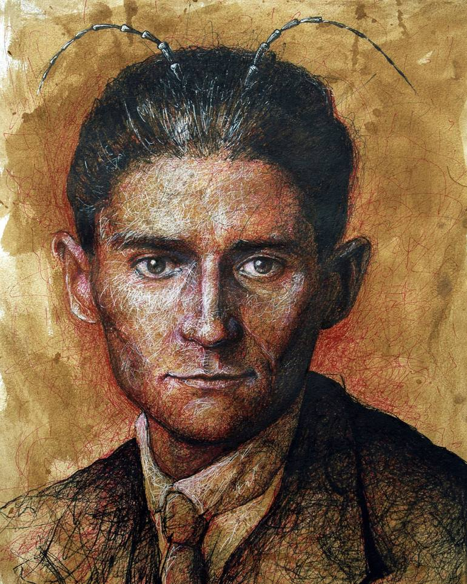

# Natural language processing course 2023/24: KafkaNet

     
    
        <em>Conversations with Characters in Stories for Literacy</em>
    

## Project description

This repository contains the code and data for the project **Conversations with
Characters in Stories for Literacy** for the *Natural language processing*
course in the year 2023/24 at the *Faculty of Computer and Information Science*
in Ljubljana.

We would like to create quick, customised personal bots from novels. Currently,
there is a world-wide literacy crisis, because young people are reading less
and less, even though literacy is vital for educational and professional
success. We would like to motivate young people to read through conversational
interactions with digital pedagogical agents in the form of persona bots. One
such solution can be provided by large language models (LLMs). There are
solutions available, but we would like to provide a model suitable for
educational purposes.

### Team members

- Blaž Erzar
- Luka Salvatore Pecoraro
- Jakob Adam Šircelj

## Repository organisation

The repository is organised into directories as follows:

- `notebooks`: Jupyter notebooks with the code for the project.
- `report`: The LaTeX source code and output PDF for the project report.
- `figures`: Figures generated by the project.

For reproducibility, we provide `requirements.txt` with the necessary Python
packages and versions.
